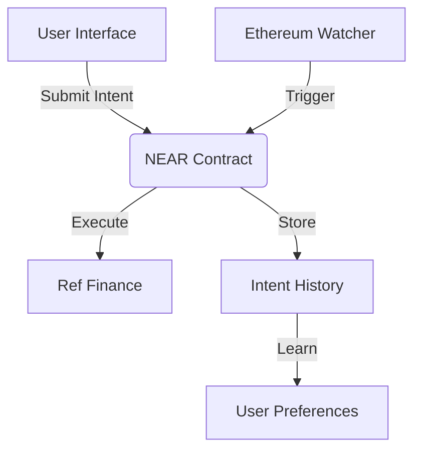

# NEAR AI Investment Agent 🤖

Autonomous investment agent that executes user-defined strategies across chains using cross-chain signatures.


## Features ✨

- **Portfolio Rebalancing**: Automatic token swaps based on allocation rules
- **Cross-Chain Execution**: Monitor Ethereum, execute on NEAR
- **Learning Agent**: Adapts to user preferences over time
- **Autonomous Operation**: Executes based on market conditions
- **Signature Security**: Ethereum-signed intents with verification

## Tech Stack 🛠️

- **Blockchain**: NEAR Protocol
- **Smart Contracts**: Rust
- **Frontend**: React + TypeScript
- **Cross-Chain**: Ethereum signatures
- **Monitoring**: Infura + CoinGecko API

## Architecture Overview



## Setup Guide 🚀

### Prerequisites
- Node.js v18+
- Rust
- NEAR CLI: `npm install -g near-cli`
- MetaMask browser extension

### 1. Clone Repository
```bash
git clone https://github.com/your-username/near-ai-agent.git
cd near-ai-agent
```

### 2. Build and Deploy Contract
```bash
# Build contract
npm run build:contract

# Create testnet account
near create-account agent.$USER.testnet --masterAccount $USER.testnet

# Deploy contract
npm run deploy:contract
```

### 3. Setup Frontend
```bash
cd frontend
npm install
```

### 4. Configure Environment
Create `.env` file in `frontend` directory:
```env
REACT_APP_CONTRACT_NAME=agent.$USER.testnet
REACT_APP_NETWORK=testnet
```

### 5. Start Applications
```bash
# In first terminal
npm run start:frontend  # Frontend at http://localhost:3000

# In second terminal
npm run start:watcher   # Ethereum watcher
```

## Usage Guide 📖

1. **Connect Wallets**:
   - Connect NEAR wallet
   - Connect MetaMask

2. **Define Investment Strategy**:
   - Set token allocations
   - Choose trigger condition
   - Submit signed intent

3. **Monitor Execution**:
   - View portfolio allocation
   - Check execution history
   - Agent auto-executes when conditions met

4. **Manual Control**:
   - Trigger immediate execution
   - Update strategy anytime

## Smart Contract Methods
| Method | Description |
|--------|-------------|
| `submit_intent` | Store investment strategy |
| `execute_intent` | Run rebalancing logic |
| `get_intent` | View current strategy |
| `get_intent_history` | View past executions |
| `register_token` | Setup token for swaps |


## License
MIT License