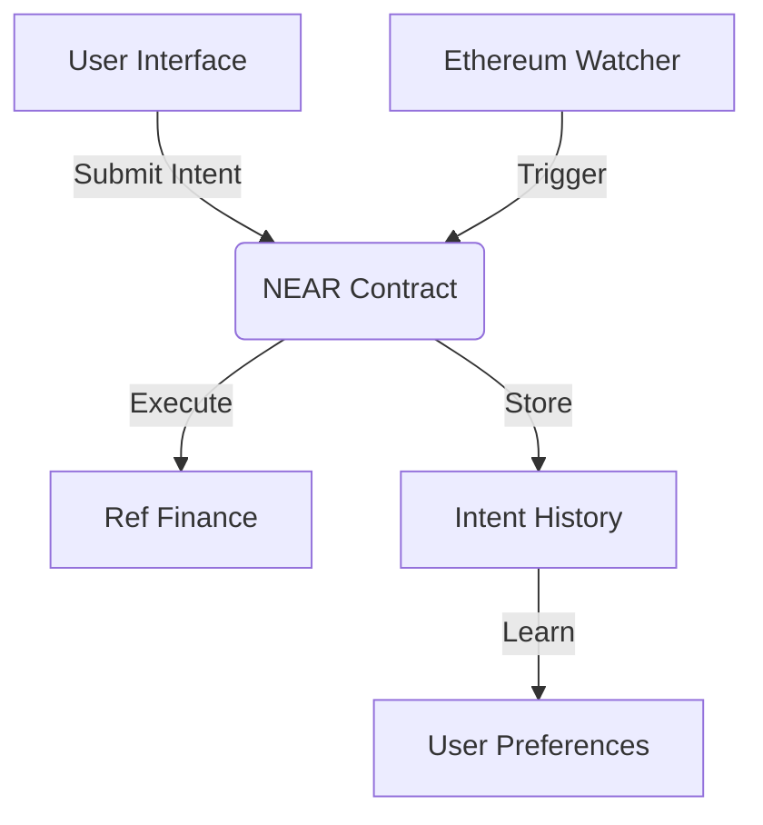

# 🤖 NEAR AI Investment Agent

Autonomous investment agent that executes user-defined strategies across chains using cross-chain signatures.

> **Status: Work in progress.** Core wallet interaction, smart contract, and Ethereum watcher are implemented. The learning/adaptation loop is partially complete. Development paused in late 2025.

---

## ✨ Features

- **Portfolio Rebalancing** — automatic token swaps based on user-defined allocation rules
- **Cross-Chain Execution** — monitor Ethereum, execute transactions on NEAR
- **Learning Agent** — adapts to user preferences over time
- **Autonomous Operation** — executes based on real-time market conditions
- **Signature Security** — Ethereum-signed intents with on-chain verification

---

## 🛠 Tech Stack

| Layer | Technology |
|---|---|
| **Blockchain** | NEAR Protocol |
| **Smart Contracts** | Rust |
| **Frontend** | React + TypeScript |
| **Cross-Chain** | Ethereum signatures |
| **Market Data** | Infura + CoinGecko API |

---

## 🏗 Architecture


```mermaid
graph TD
    A[User Interface] -->|Submit Intent| B(NEAR Contract)
    C[Ethereum Watcher] -->|Trigger| B
    B -->|Execute| D[Ref Finance]
    B -->|Store| E[Intent History]
    E -->|Learn| F[User Preferences]
```

---

## 🚀 Setup Guide

### Prerequisites
- Node.js v18+
- Rust toolchain
- NEAR CLI: `npm install -g near-cli`
- MetaMask browser extension

### 1. Clone Repository
```bash
git clone https://github.com/KEERTHIVASANchsm/near-ai-agent.git
cd near-ai-agent
```

### 2. Build and Deploy Contract
```bash
# Build Rust contract
npm run build:contract

# Create testnet account
near create-account agent.$USER.testnet --masterAccount $USER.testnet

# Deploy contract to testnet
npm run deploy:contract
```

### 3. Setup Frontend
```bash
cd frontend
npm install
```

### 4. Configure Environment
Create a `.env` file in the `frontend` directory:
```env
REACT_APP_CONTRACT_NAME=agent.$USER.testnet
REACT_APP_NETWORK=testnet
```

### 5. Start Applications
```bash
# Terminal 1 — Frontend
npm run start:frontend    # → http://localhost:3000

# Terminal 2 — Ethereum watcher
npm run start:watcher
```

---

## 📖 Usage

1. **Connect Wallets** — connect NEAR wallet + MetaMask
2. **Define Strategy** — set token allocations, choose trigger condition, submit signed intent
3. **Monitor Execution** — view portfolio allocation, check execution history
4. **Manual Control** — trigger immediate execution or update strategy anytime

---

## 📋 Smart Contract Methods

| Method | Description |
|---|---|
| `submit_intent` | Store a new investment strategy |
| `execute_intent` | Run the rebalancing logic |
| `get_intent` | View current active strategy |
| `get_intent_history` | View past executions |
| `register_token` | Register a token for swaps |

---

## 🔭 What I Was Exploring

- How AI agents can interact with smart contracts without a human in the loop
- Security challenges of giving an agent signing authority over a wallet
- Whether on-chain conditions can reliably trigger off-chain AI decisions
- Cross-chain intent architecture — where "smart contract" ends and "AI agent" begins

---

## 📌 Context

Built in 2025 as independent exploration after working with ICP canisters and Ethereum smart contracts. Wanted to understand NEAR's developer experience and push into the AI × Web3 space. Open to collaboration — feel free to open an issue.

---

## 📄 License
MIT License
